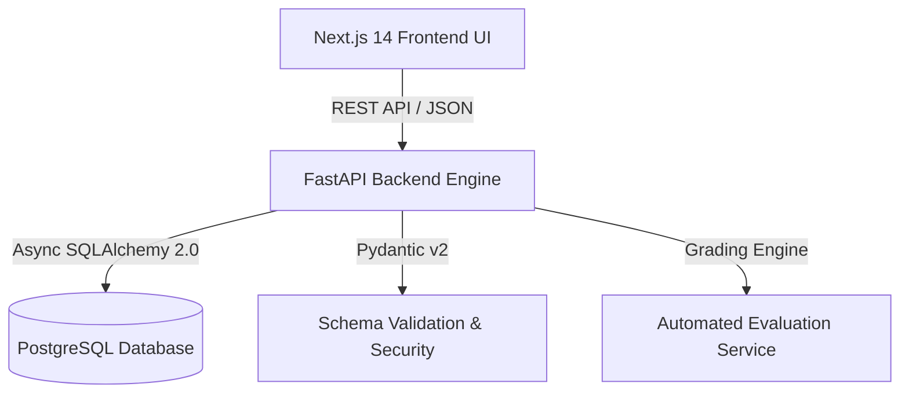
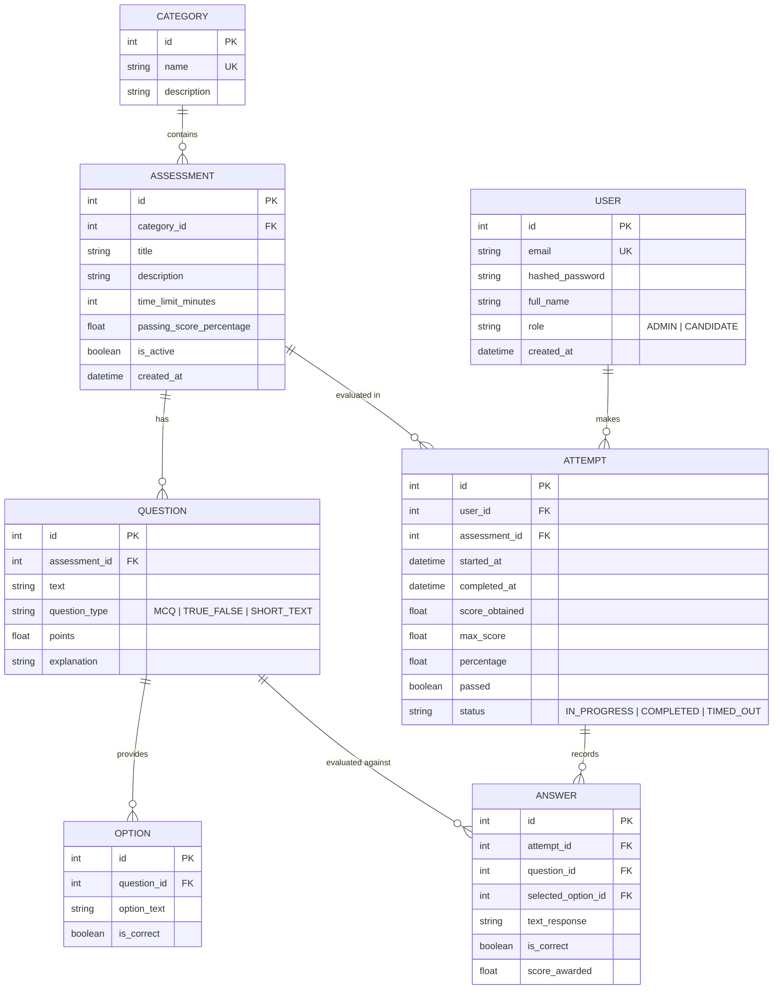
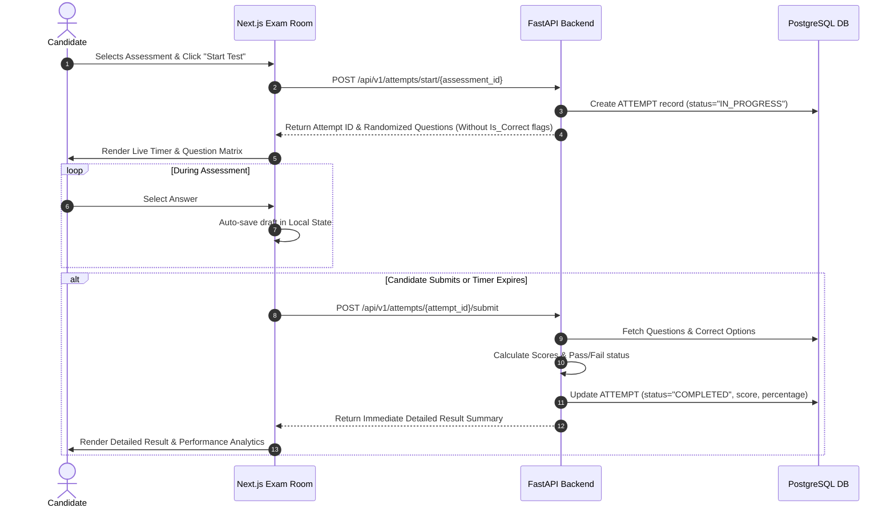

# System Architecture & Database Design

This document details the architectural design, database relationships, and data flow pipelines for the **METI Assessment Platform**.

---

## 🏗️ High-Level Architecture

The platform follows a modern decoupled architecture:

### Components

1. **Frontend (Client Tier)**
   - **Framework**: Next.js 14 (App Router)
   - **State & Auth**: Client React Context + LocalStorage JWT token management
   - **UI Design**: Modern glassmorphism, responsive grid layout, Lucide icon set, real-time timer hooks.

2. **Backend (API Tier)**
   - **Framework**: FastAPI (Asynchronous Python 3.10+)
   - **Security**: OAuth2 Bearer password flow, JWT tokens (`HS256`), Bcrypt password hashing.
   - **ORM & DB Layer**: Async SQLAlchemy 2.0 with SQLite / PostgreSQL database backends.
   - **Scoring Engine**: Synchronous & automated grading module calculating percentage scores, pass/fail status, and per-question correctness.

3. **Database Tier**
   - **RDBMS**: PostgreSQL 15 / SQLite
   - **Tables**: Users, Categories, Assessments, Questions, Options, Attempts, Answers.

---

## 🗄️ Database ERD Schema

---

## 🔄 Assessment Execution Sequence

